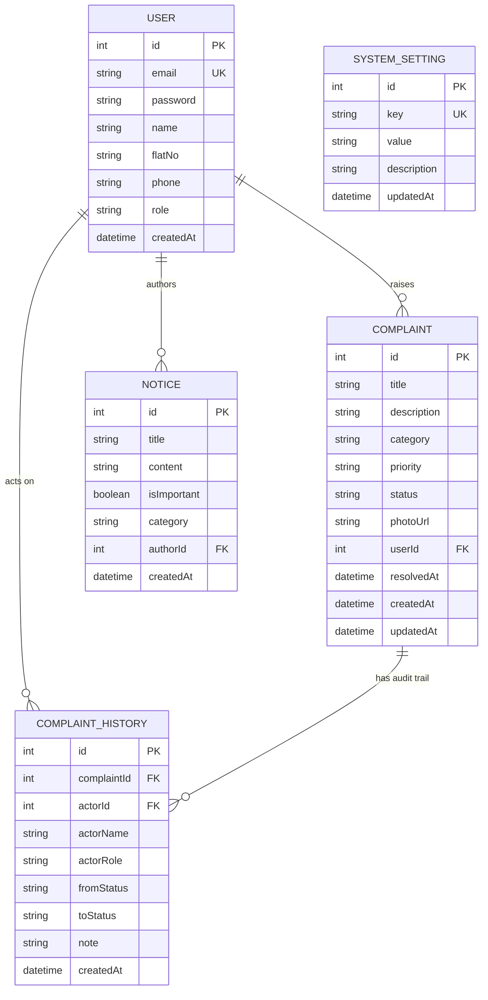

# 🏢 Society Maintenance Tracker

A modern, full-stack web application designed for residential apartment societies to streamline complaint management, audit status history, detect overdue maintenance tickets, broadcast important notices, and automatically keep residents updated via email notifications.

---

## 🌟 Key Features

- **Role-Based Authentication**: Dedicated portals for **Residents** (raise & track complaints, view notices) and **Administrators** (manage complaints, adjust priorities, update statuses, publish notices, configure overdue rules).
- **Complaint Lifecycle & Audit Timeline**: Immutable audit trail recording every state change (`OPEN` $\to$ `IN_PROGRESS` $\to$ `RESOLVED`), actor information, timestamp, and technician resolution notes.
- **Dynamic Overdue Detection**: Configurable threshold (e.g., 3 days) that automatically flags unresolved tickets and surfaces them to the top of the admin queue.
- **Notice Board with Priority Pinning**: Admin announcements with support for pinned "Important" notices that trigger instant email alerts to all residents.
- **Email Notifications**: Automated HTML notifications for complaint status changes and urgent society announcements (supports custom SMTP or automatic Ethereal test inbox generation).
- **Interactive Dashboard & Analytics**: High-level metrics, category breakdown charts, status distribution pie charts, and quick-action overdue queues.
- **Photo Uploads**: Support for attaching image evidence to complaints with client-side preview and full-size modal view.

---

## 🏗️ Tech Stack

- **Backend**: Node.js, Express, TypeScript, Prisma ORM, Multer, Nodemailer, bcryptjs, jsonwebtoken
- **Frontend**: React 18, Vite, TypeScript, Tailwind CSS, Lucide Icons, Recharts, Axios, date-fns
- **Database**: SQLite (via Prisma) — zero configuration, fully portable, easily swappable with PostgreSQL or MySQL
- **Tooling & Orchestration**: Concurrently, tsx, PostCSS

---

## 🚀 Quick Start Guide

### Prerequisites
- [Node.js](https://nodejs.org/) (v18 or higher)
- `npm` (comes with Node.js)

### 1. Clone & Install Dependencies

From the project root:
```bash
# Install root, backend, and frontend dependencies
npm run install:all
```

Alternatively, install individually:
```bash
npm install
cd backend && npm install
cd ../frontend && npm install
```

### 2. Database Migration & Seeding

```bash
# Setup database schema and load realistic sample data
cd backend
npx prisma db push
npm run seed
```

### 3. Run the Application

Start both backend and frontend servers concurrently:
```bash
# From project root:
npm run dev
```

- **Frontend Application**: `http://localhost:5173`
- **Backend API**: `http://localhost:5000`
- **Health Check**: `http://localhost:5000/api/health`

---

## 🔑 Demo Seed Accounts

| Role | Email | Password | Flat No | Access / Purpose |
| :--- | :--- | :--- | :--- | :--- |
| **Admin** | `admin@society.com` | `admin123` | `Office-101` | Full administrative console, stats, settings |
| **Resident** | `john.doe@example.com` | `resident123` | `A-102` | Resident portal, raise and track complaints |
| **Resident** | `sarah.jenkins@example.com` | `resident123` | `B-404` | Resident portal |
| **Resident** | `rohit.sharma@example.com` | `resident123` | `C-701` | Resident portal |

*(Quick demo login buttons are also available directly on the login page)*

---

## ⚙️ Environment Configuration

### Backend `.env`
```env
PORT=5000
DATABASE_URL="file:./dev.db"
JWT_SECRET="super-secret-society-jwt-key-2026"
CLIENT_URL="http://localhost:5173"

# Optional Custom SMTP settings (Falls back to auto-generated test Ethereal inbox)
# SMTP_HOST="smtp.ethereal.email"
# SMTP_PORT=587
# SMTP_USER="your-email@example.com"
# SMTP_PASS="your-email-password"
# SMTP_FROM="Society Maintenance Portal <noreply@societytracker.com>"
```

### Frontend `.env` (Optional)
```env
VITE_API_URL="http://localhost:5000/api"
```

---

## 📡 API Reference

### Authentication (`/api/auth`)
| Method | Endpoint | Description | Auth Required |
| :--- | :--- | :--- | :--- |
| `POST` | `/api/auth/register` | Register a new resident account | No |
| `POST` | `/api/auth/login` | Sign in with email & password | No |
| `GET` | `/api/auth/me` | Retrieve current user profile | Yes (Bearer) |

### Complaints (`/api/complaints`)
| Method | Endpoint | Description | Auth Required |
| :--- | :--- | :--- | :--- |
| `POST` | `/api/complaints` | Raise a new complaint (with optional photo) | Resident |
| `GET` | `/api/complaints/my` | Get all complaints created by logged-in resident | Resident |
| `GET` | `/api/complaints` | Get all society complaints (with filters: status, category, date, overdue) | Admin |
| `GET` | `/api/complaints/:id` | Get complaint details and full timeline history | Resident (own) / Admin |
| `PATCH` | `/api/complaints/:id/status` | Update status (`OPEN`, `IN_PROGRESS`, `RESOLVED`) + note | Admin |
| `PATCH` | `/api/complaints/:id/priority` | Update priority (`LOW`, `MEDIUM`, `HIGH`) | Admin |

### Notices (`/api/notices`)
| Method | Endpoint | Description | Auth Required |
| :--- | :--- | :--- | :--- |
| `GET` | `/api/notices` | List all active notices (pinned on top) | Authenticated |
| `POST` | `/api/notices` | Post a new notice (`isImportant` sends broadcast email) | Admin |
| `DELETE` | `/api/notices/:id` | Delete a notice | Admin |

### Dashboard & Settings
| Method | Endpoint | Description | Auth Required |
| :--- | :--- | :--- | :--- |
| `GET` | `/api/dashboard/stats` | Retrieve aggregate metrics and chart data | Admin |
| `GET` | `/api/settings` | Get system settings (overdue threshold) | Admin |
| `PATCH` | `/api/settings/overdue-threshold` | Update overdue threshold in days | Admin |

---

## 🗄️ Database Schema Overview



---

## 🌐 Deployment Instructions

### Deploy to Render / Railway / Heroku
1. **Backend**:
   - Set build command: `npm install && npx prisma generate && npm run build`
   - Set start command: `npm start`
   - Configure environment variables (`DATABASE_URL`, `JWT_SECRET`, `CLIENT_URL`).
2. **Frontend (Vercel / Netlify / Render Static Site)**:
   - Set root directory: `frontend`
   - Build command: `npm run build`
   - Output directory: `dist`
   - Configure `VITE_API_URL` to point to your backend API URL.

---

## 📄 Deliverables Summary

- **Source Code**: Complete backend API + React Vite frontend.
- **System Design Document**: [`SYSTEM_DESIGN.md`](./SYSTEM_DESIGN.md) covering history model, overdue calculation, photo handling, and email flow.
- **Database Migrations & Seed**: Fully automated via Prisma.
